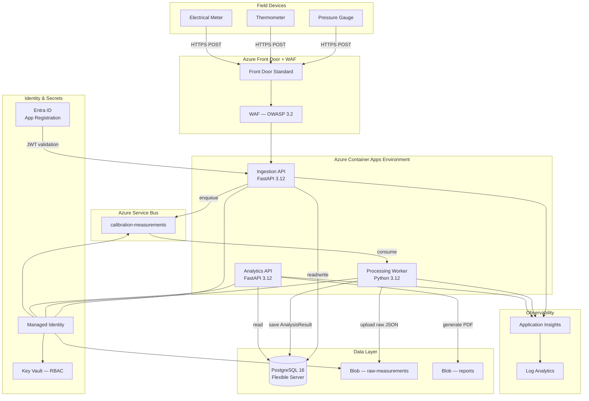

# Cloud Calibration Platform

> Production-grade cloud platform for ISO 17025-compliant calibration measurement data — ingestion, anomaly detection, analytics, and certificate generation on Azure.

[](https://github.com/Aliipou/cloud-calibration-platform/actions/workflows/ci.yml)
[](https://github.com/Aliipou/cloud-calibration-platform/actions/workflows/security-scan.yml)
[](https://codecov.io/gh/Aliipou/cloud-calibration-platform)
[](LICENSE)

---

## Problem Statement

Industrial calibration labs generate thousands of measurement records daily from pressure gauges, thermometers, electrical meters, and flow instruments. Records must be:

- **Retained for 10+ years** per ISO 17025 and national metrology regulations
- **Anomaly-detected in near-real-time** to flag out-of-tolerance readings before certificates are issued
- **Fully auditable** — every operation traceable to an authenticated, role-bound operator
- **EU data-resident** — GDPR and metrology compliance require data to stay in European Azure regions

Legacy on-premises systems lack automated anomaly detection, cannot scale past ~1k measurements/day, and require manual certificate creation. This platform replaces all three with a managed, serverless-first architecture on Azure.

---

## Architecture



### Data Flow

```
Device  →  HTTPS POST /api/v1/measurements
        →  Ingestion API  (auth · validate · rate-limit)
        →  202 Accepted  +  measurement_id
        →  Enqueue to Service Bus  (Redis in dev)
        →  Worker picks up message
        →  Upload raw JSON to Blob Storage
        →  Z-score anomaly detection
        →  INSERT AnalysisResult into PostgreSQL
        →  UPDATE status: VALIDATED | ANOMALY
        →  Analytics API serves trend data + anomaly list
        →  POST /api/v1/reports/calibration-certificate
        →  reportlab PDF  →  Blob Storage  →  SAS URL returned
```

---

## Technology Stack

| Layer | Technology | Why |
|-------|-----------|-----|
| API | Python 3.12, FastAPI 0.111 | Async-native, OpenAPI auto-generated, Pydantic v2 validation |
| Worker | Python 3.12, azure-servicebus SDK | Native AMQP, proper dead-lettering, no wrapper overhead |
| ORM | SQLAlchemy 2.0 async + asyncpg | True async driver, typed mapped columns |
| Database | Azure PostgreSQL 16 Flexible Server | Managed, AAD-only auth, zone-redundant, private endpoint |
| Queue | Azure Service Bus | At-least-once, dead-letter queue, AMQP, RBAC |
| Storage | Azure Blob Storage | Lifecycle policy (hot→cool→archive), private endpoint |
| Secrets | Azure Key Vault RBAC | MI-only access, no access policies, purge protection |
| Auth | Azure Entra ID JWT + JWKS | RS256, role claims, no shared secrets |
| IaC | Terraform 1.7, azurerm ~> 3.90 | Declarative, OIDC backend, plan artifacts |
| Runtime | Azure Container Apps + KEDA | Serverless, scale-to-zero worker, no cluster management |
| Edge | Azure Front Door Standard + WAF | Global PoP, OWASP 3.2, bot manager, Prevention mode |
| CI/CD | GitHub Actions + OIDC | Zero stored credentials, federated identity |
| Observability | structlog JSON + OpenTelemetry + App Insights | Correlation IDs, distributed tracing |
| Security | Trivy, CodeQL, Checkov, pip-audit | SARIF uploads to GitHub Security tab |

---

## Quick Start

### Prerequisites

- Docker Desktop ≥ 4.25
- Python 3.12
- Terraform ≥ 1.7
- Azure CLI ≥ 2.55
- `make`

### Local Development

```bash
git clone https://github.com/Aliipou/cloud-calibration-platform.git
cd cloud-calibration-platform

cp .env.example .env

# Start PostgreSQL 16 + Redis 7 + API + Worker
make dev

# Apply database migrations
make migrate

# Verify
curl http://localhost:8000/healthz
# {"status":"ok","database":"connected","version":"1.0.0"}
```

### Run Tests

```bash
make test
# pytest with coverage — fails if <80%
```

### Lint

```bash
make lint
# ruff check + ruff format --check + mypy
```

### Dev Authentication

No Azure Entra ID required locally. Use the dev bypass header:

```bash
curl -H 'X-Dev-User: {"sub":"dev-user","roles":["Admin"],"email":"dev@local"}' \
     -H 'Content-Type: application/json' \
     -d '{
       "device_id": "PG-001",
       "measurement_type": "PRESSURE",
       "measured_value": 100.32,
       "reference_value": 100.00,
       "uncertainty": 0.15,
       "unit": "bar",
       "operator_id": "op-001"
     }' \
     http://localhost:8000/api/v1/measurements
# HTTP 202 Accepted
```

---

## Deployment

### 1. Provision Infrastructure

```bash
az login

# Dev environment
make tf-plan ENV=dev
make tf-apply ENV=dev
```

Terraform provisions 9 modules in dependency order:

| # | Module | Resources |
|---|--------|-----------|
| 1 | networking | VNet, subnets, NSGs, 4 private DNS zones |
| 2 | identity | Managed Identity, App Registration, OIDC federated credentials |
| 3 | keyvault | Key Vault (RBAC mode, purge protection) |
| 4 | database | PostgreSQL 16 Flexible Server, private endpoint |
| 5 | messaging | Service Bus namespace + queue, RBAC assignments |
| 6 | storage | Blob Storage, containers, lifecycle policy |
| 7 | monitoring | Log Analytics, App Insights, metric alerts |
| 8 | compute | Container Apps Environment + 3 apps with KEDA |
| 9 | frontdoor | Front Door Standard, WAF OWASP 3.2 |

### 2. CI/CD Pipeline

```
push to main  →  CI (lint → test → docker build → tf validate)
              ↓ success
              →  CD Deploy (OIDC → ACR push → az containerapp update → smoke test /healthz)
              ↓ failure
              →  auto-rollback to previous ACR revision
```

All Azure authentication in GitHub Actions uses **OIDC federated credentials** — no client secrets stored anywhere.

### 3. Environment Variables

| Variable | Required | Description |
|----------|----------|-------------|
| `DATABASE_URL` | Yes | `postgresql+asyncpg://...` |
| `AZURE_TENANT_ID` | Yes | Entra ID tenant for JWT validation |
| `AZURE_CLIENT_ID` | Yes | App Registration client ID |
| `KEY_VAULT_URL` | Yes | Key Vault URI |
| `SERVICEBUS_NAMESPACE` | Yes | Service Bus FQDN |
| `STORAGE_ACCOUNT_NAME` | Prod | Azure Storage account |
| `REDIS_URL` | Dev | `redis://localhost:6379` |
| `DEV_MODE` | Dev | `true` enables X-Dev-User bypass |
| `ANOMALY_THRESHOLD` | No | Z-score threshold, default `3.0` |
| `RATE_LIMIT_RPS` | No | Per-user limit, default `10` |

---

## API Reference

Base URL: `https://<front-door-hostname>`

All endpoints except `/healthz` and `/readyz` require a Bearer JWT or `X-Dev-User` header in dev mode.

### Health

| Method | Path | Auth | Description |
|--------|------|------|-------------|
| `GET` | `/healthz` | None | Liveness — 200 if process alive |
| `GET` | `/readyz` | None | Readiness — checks DB connectivity |

### Devices

| Method | Path | Min Role | Description |
|--------|------|----------|-------------|
| `GET` | `/api/v1/devices` | Viewer | List registered devices |
| `GET` | `/api/v1/devices/{id}` | Viewer | Get device by ID |
| `POST` | `/api/v1/devices` | Admin | Register new device |
| `PUT` | `/api/v1/devices/{id}` | Admin | Update device metadata |

### Measurements

| Method | Path | Min Role | Description |
|--------|------|----------|-------------|
| `POST` | `/api/v1/measurements` | Operator | Ingest measurement (async 202) |
| `GET` | `/api/v1/measurements` | Viewer | List with pagination |
| `GET` | `/api/v1/measurements/{id}` | Viewer | Get by ID |

**POST body:**
```json
{
  "device_id": "PG-001",
  "measurement_type": "PRESSURE",
  "measured_value": 100.32,
  "reference_value": 100.00,
  "uncertainty": 0.15,
  "unit": "bar",
  "temperature_ambient": 23.1,
  "operator_id": "op-47a2b"
}
```

**202 response:**
```json
{
  "measurement_id": "550e8400-e29b-41d4-a716-446655440000",
  "status": "RECEIVED",
  "queued_at": "2024-03-15T10:23:45.123Z"
}
```

### Analytics

| Method | Path | Min Role | Description |
|--------|------|----------|-------------|
| `GET` | `/api/v1/analytics/summary` | Viewer | Totals, validated/anomaly counts, rate |
| `GET` | `/api/v1/analytics/devices/{id}/trend` | Viewer | Device time-series trend |
| `GET` | `/api/v1/analytics/anomalies` | Viewer | Anomaly list, filterable by device |

### Reports

| Method | Path | Min Role | Description |
|--------|------|----------|-------------|
| `POST` | `/api/v1/reports/calibration-certificate` | Operator | Generate ISO 17025 PDF, return SAS URL |

### Error Format (RFC 7807)

```json
{
  "type": "https://calibration.example.com/errors/validation-error",
  "title": "Validation Error",
  "status": 422,
  "detail": "uncertainty must be > 0",
  "instance": "/api/v1/measurements",
  "request_id": "req-abc123"
}
```

---

## Security Model

### Role Matrix

| Action | Admin | Operator | Viewer |
|--------|:-----:|:--------:|:------:|
| Register device | ✓ | ✗ | ✗ |
| Ingest measurement | ✓ | ✓ | ✗ |
| View analytics | ✓ | ✓ | ✓ |
| Generate certificate | ✓ | ✓ | ✗ |
| Manage users | ✓ | ✗ | ✗ |

Roles are **Azure AD App Roles** assigned per user or service principal.

### Network Isolation

All Azure data resources (PostgreSQL, Service Bus, Blob, Key Vault) are **private endpoint only** — no public internet access. Traffic flows:

```
Internet → Front Door (TLS termination, WAF) → Container Apps (VNet-injected) → Private endpoints
```

NSGs enforce deny-by-default on all subnets.

### Credential Policy

- Zero secrets in source code or environment variables
- All runtime secrets fetched from Key Vault via Managed Identity
- CI/CD uses OIDC federated credentials — no client secrets in GitHub Secrets
- Managed Identity scoped to minimum required RBAC roles

### ISO 17025 Compliance

- 10-year retention via Blob lifecycle (hot → cool → archive)
- `AuditLog` table records every API operation: who, what, when, which resource
- EU-only data residency (North Europe primary, West Europe replica)
- RTO < 4 hours, RPO < 1 hour via zone-redundant PostgreSQL + geo-redundant Blob

---

## Anomaly Detection

Z-score analysis in the processing worker:

```
z = |measured_value − reference_value| / uncertainty
```

| Z-score | Status | Outcome |
|---------|--------|---------|
| < 3.0 | `VALIDATED` | Certificate eligible |
| ≥ 3.0 | `ANOMALY` | Flagged for operator review |

Threshold is configurable via `ANOMALY_THRESHOLD` env var to support 2σ, 3σ, or lab-specific thresholds per instrument type.

---

## Scaling

### KEDA Scale Rules

| Service | Trigger | Min | Max (prod) |
|---------|---------|-----|-----------|
| Ingestion API | HTTP concurrent | 1 | 10 |
| Processing Worker | Service Bus queue depth | 0 | 10 |
| Analytics API | HTTP concurrent | 1 | 5 |

Worker scales to **zero** when the queue is empty — no idle compute cost overnight.

### Throughput

- 10k measurements/day → 0.12 RPS average → comfortably handled by 1 replica
- Peak 1k/hour → 0.28 RPS → single replica with headroom before KEDA triggers scale-out

---

## Cost Estimation

### Development (~€31/month)

| Resource | SKU | Cost |
|----------|-----|------|
| PostgreSQL Flexible | Standard_B1ms | ~€15 |
| Service Bus | Basic | <€1 |
| Container Apps | Consumption, min 1 replica | ~€8 |
| Blob Storage | LRS, ~10 GB | <€1 |
| Front Door Standard | — | ~€5 |
| Log Analytics | ~1 GB/day | ~€3 |

### Production (~€307/month)

| Resource | SKU | Cost |
|----------|-----|------|
| PostgreSQL Flexible | Standard_D2s_v3, zone-redundant | ~€120 |
| Service Bus | Standard | ~€10 |
| Container Apps | Consumption, min 2 replicas | ~€80 |
| Blob Storage | GRS, ~500 GB + lifecycle | ~€25 |
| Front Door + WAF | Standard | ~€40 |
| Key Vault | Standard | ~€2 |
| Log Analytics | ~10 GB/day | ~€30 |

---

## Architecture Decision Records

| # | Decision | Status |
|---|----------|--------|
| [ADR-001](docs/adr/001-async-python.md) | Python FastAPI over .NET/Go | Accepted |
| [ADR-002](docs/adr/002-container-apps.md) | Azure Container Apps over AKS | Accepted |
| [ADR-003](docs/adr/003-service-bus.md) | Service Bus over Event Hubs for measurement queue | Accepted |
| [ADR-004](docs/adr/004-oidc-only.md) | OIDC federated credentials — zero stored secrets | Accepted |

---

## Repository Structure

```
cloud-calibration-platform/
├── api/                        # FastAPI application (ingestion + analytics)
│   ├── src/
│   │   ├── core/               # Auth, middleware, rate limiter, logging
│   │   ├── db/                 # Async engine, repository pattern
│   │   ├── models/             # SQLAlchemy models, Pydantic schemas, enums
│   │   ├── routes/             # HTTP handlers
│   │   ├── services/           # Business logic
│   │   └── main.py
│   ├── alembic/                # Database migrations
│   ├── tests/                  # pytest-asyncio suite (>80% coverage)
│   ├── Dockerfile
│   └── pyproject.toml
├── worker/                     # Service Bus consumer + anomaly detector
│   ├── src/
│   │   ├── anomaly_detector.py
│   │   ├── processor.py
│   │   ├── storage.py
│   │   └── main.py
│   ├── tests/
│   ├── Dockerfile
│   └── pyproject.toml
├── terraform/                  # Azure IaC — 9 modules
│   ├── modules/{networking,identity,keyvault,database,messaging,storage,monitoring,compute,frontdoor}/
│   ├── environments/{dev,prod}.tfvars
│   └── main.tf
├── .github/workflows/
│   ├── ci.yml                  # Lint + test + docker build + tf validate
│   ├── cd-infra.yml            # Terraform plan → approval → apply
│   ├── cd-deploy.yml           # OIDC → ACR → containerapp update → smoke test
│   └── security-scan.yml       # Trivy + pip-audit + Checkov + CodeQL
├── docs/
│   ├── adr/                    # Architecture Decision Records 001–004
│   ├── architecture.md         # C4 diagrams
│   └── runbook.md              # On-call procedures
├── docker-compose.yml
├── Makefile
└── .env.example
```

---

## License

MIT © 2024 Ali Pourrahim
