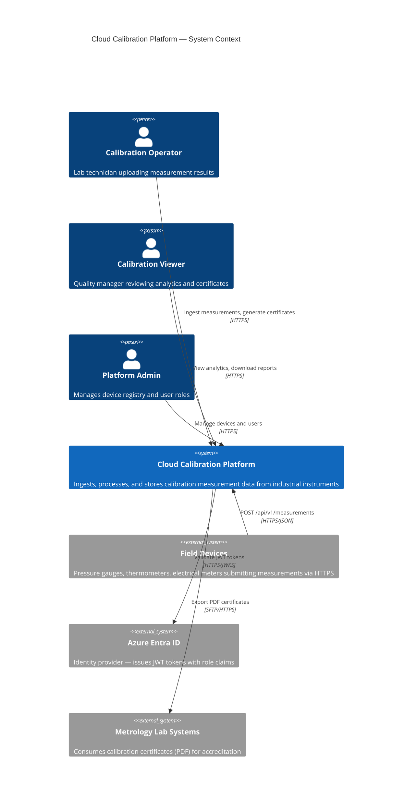
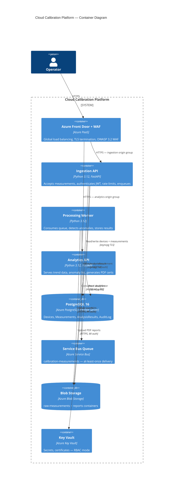
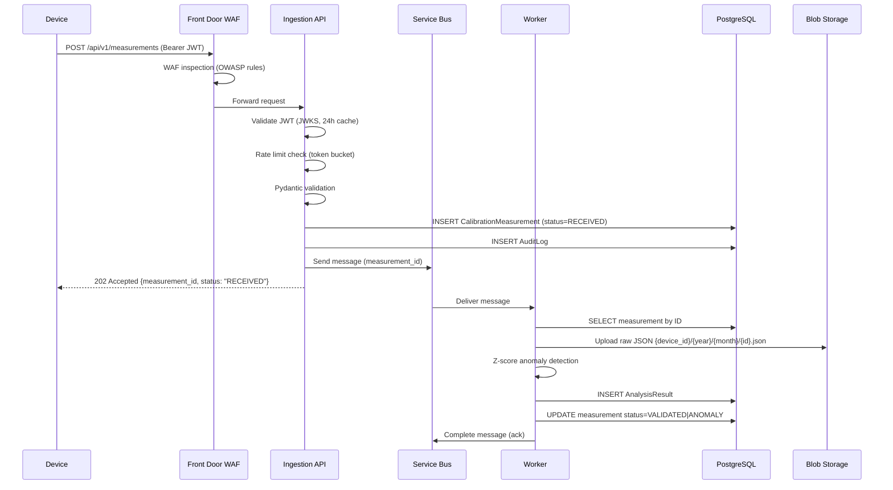

# Architecture

## C4 Model — System Context



## C4 Model — Container Diagram



## Networking

```
VNet: 10.0.0.0/16
├── app-subnet: 10.0.1.0/24   (Container Apps delegation)
└── data-subnet: 10.0.2.0/24  (Private endpoints)

Private DNS Zones (linked to VNet):
├── privatelink.postgres.database.azure.com
├── privatelink.servicebus.windows.net
├── privatelink.blob.core.windows.net
└── privatelink.vaultcore.azure.net

NSGs:
├── app-nsg: allow HTTPS inbound from Front Door, deny all else
└── data-nsg: allow 5432/5671/443 from app-subnet only
```

## Sequence: Measurement Ingestion



## Scaling Architecture

```
KEDA Scale Rules:
┌─────────────────────────────────────────────┐
│ Ingestion API                               │
│   trigger: HTTP concurrent requests         │
│   threshold: 10 concurrent / replica        │
│   min: 1  max: 10 (prod)                   │
├─────────────────────────────────────────────┤
│ Processing Worker                           │
│   trigger: Service Bus queue depth          │
│   threshold: 5 messages / replica           │
│   min: 0  max: 10 (prod) ← scales to zero  │
├─────────────────────────────────────────────┤
│ Analytics API                               │
│   trigger: HTTP concurrent requests         │
│   threshold: 10 concurrent / replica        │
│   min: 1  max: 5 (prod)                    │
└─────────────────────────────────────────────┘
```
